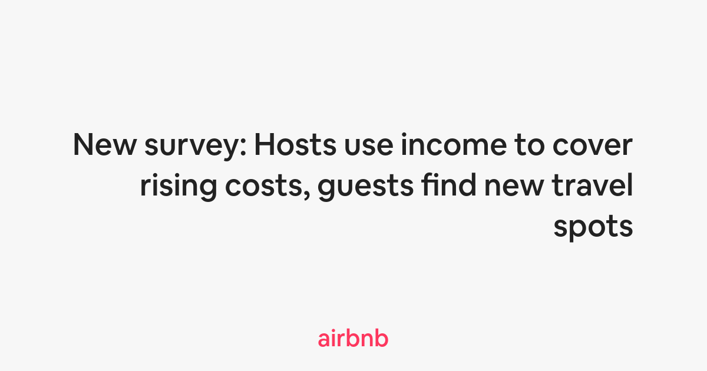
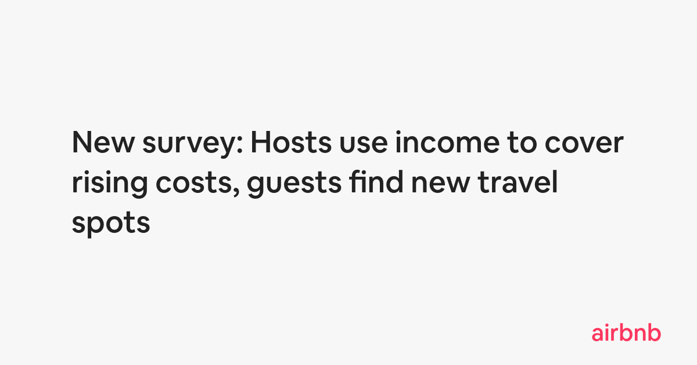
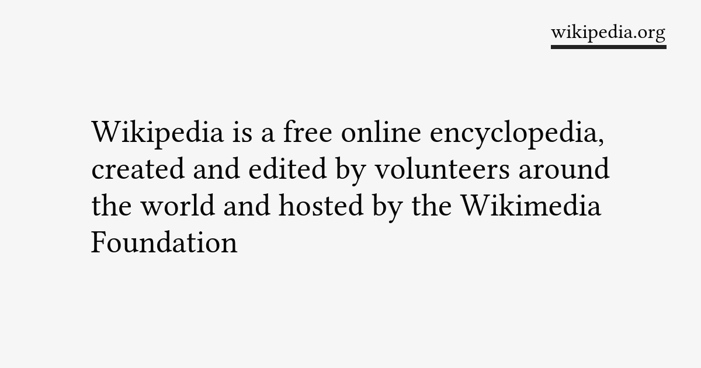
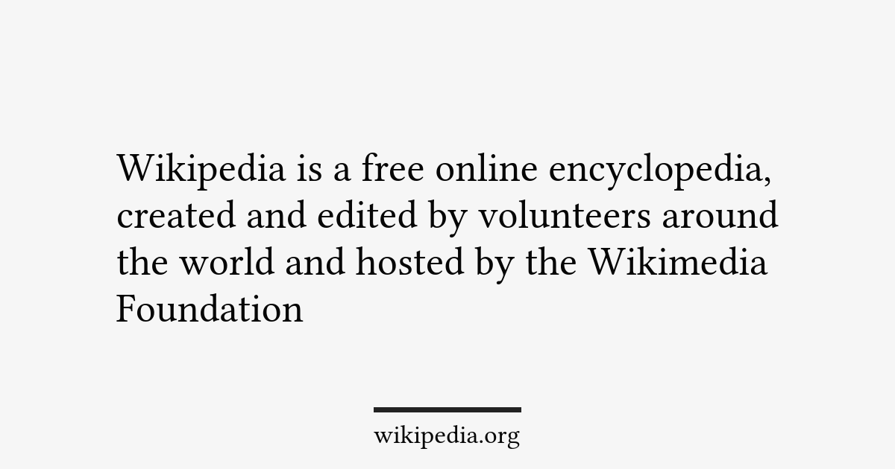

# Examples


<details>
  <summary>show configuration:</summary>

```php
$config = [
    'background_color' => '#18202A',
    
    'font_size' => 58,
    'text_color' => '#fff',
    'text_alignment' => 'right',
    
    'app_name' => 'amazon',
    'app_name_font_size' => 40,
    'app_name_color' => '#fff',
    'app_name_position' => 'center-top',
    'app_name_decoration_style' => 'rectangle',
    'app_name_decoration_color' => '#FE9823',
    
    // Font: Amazon Ember Medium (not included in the package)
];
```
</details>


<details>
  <summary>show configuration:</summary>

```php
$config = [
    'background_color' => '#18202A',
    
    'font_size' => 58,
    'text_color' => '#fff',
    'text_alignment' => 'right',

    'app_name' => 'amazon',
    'app_name_font_size' => 40,
    'app_name_color' => '#fff',
    'app_name_position' => 'left-bottom',
    'app_name_decoration_style' => 'label',
    'app_name_decoration_color' => '#FE9823',
    
    // Font: Amazon Ember Medium (not included in the package)
];
```
</details>


<details>
  <summary>show configuration:</summary>

```php
$config = [
    'background_color' => '#F7F7F7',
    
    'font_size' => 52,
    'text_color' => '#222222',
    'text_alignment' => 'right',

    'app_name' => 'airbnb',
    'app_name_font_size' => 40,
    'app_name_color' => '#FD375E',
    'app_name_position' => 'bottom-center',
    'app_name_decoration_style' => null,
    'app_name_decoration_color' => '#FD375E',

    // Font: Airbnb Cereal (not included in the package)
];
```
</details>


<details>
  <summary>show configuration:</summary>

```php
$config = [
    'background_color' => '#F7F7F7',
    
    'font_size' => 52,
    'text_color' => '#222222',
    'text_alignment' => 'left',

    'app_name' => 'airbnb',
    'app_name_font_size' => 40,
    'app_name_color' => '#FD375E',
    'app_name_position' => 'right-bottom',
    'app_name_decoration_style' => null,
    'app_name_decoration_color' => '#FD375E',

    // Font: Airbnb Cereal (not included in the package)
];
```
</details>


<details>
  <summary>show configuration:</summary>

```php
$config = [   
    'background_color' => '#034F33',
    
    'font_size' => 60,
    'text_color' => '#fff',
    'text_alignment' => 'right',

    'app_name' => 'Tripadvisor',
    'app_name_font_size' => 30,
    'app_name_color' => '#fff',
    'app_name_position' => 'center-top',
    'app_name_decoration_style' => 'line',
    'app_name_decoration_color' => '#fff',

    // Font: TripSans (not included in the package)
];
```
</details>


<details>
  <summary>show configuration:</summary>

```php
$config = [   
    'background_color' => '#034F33',
    
    'font_size' => 60,
    'text_color' => '#fff',
    'text_alignment' => 'right',

    'app_name' => 'Tripadvisor',
    'app_name_font_size' => 30,
    'app_name_color' => '#000',
    'app_name_position' => 'bottom-center',
    'app_name_decoration_style' => 'rectangle',
    'app_name_decoration_color' => '#fff',

    // Font: TripSans (not included in the package)
];
```
</details>


<details>
  <summary>show configuration:</summary>

```php
$config = [      
    'background_color' => '#103C8A',
    
    'font_size' => 54,
    'text_color' => '#fff',
    'text_alignment' => 'left',

    'app_name' => 'www.nasa.gov',
    'app_name_font_size' => 40,
    'app_name_color' => '#fff',
    'app_name_position' => 'left-top',
    'app_name_decoration_style' => 'label',
    'app_name_decoration_color' => '#FA3C2B',

    // Font: Titillium Web (not included in the package)
];
```
</details>


<details>
  <summary>show configuration:</summary>

```php
$config = [      
    'background_color' => '#103C8A',
    
    'font_size' => 54,
    'text_color' => '#fff',
    'text_alignment' => 'left',

    'app_name' => 'www.nasa.gov',
    'app_name_font_size' => 40,
    'app_name_color' => '#fff',
    'app_name_position' => 'center-top',
    'app_name_decoration_style' => 'line',
    'app_name_decoration_color' => '#FA3C2B',

    // Font: Titillium Web (not included in the package)
];
```
</details>


<details>
  <summary>show configuration:</summary>

```php
$config = [      
    'background_color' => '#F6F6F6',
    
    'font_size' => 54,
    'text_color' => '#060606',
    'text_alignment' => 'left',

    'app_name' => 'wikipedia.org',
    'app_name_font_size' => 35,
    'app_name_color' => '#060606',
    'app_name_position' => 'right-top',
    'app_name_decoration_style' => 'line',
    'app_name_decoration_color' => '#222',

    // Font: Linux Libertine (not included in the package)
];
```
</details>


<details>
  <summary>show configuration:</summary>

```php
$config = [      
    'background_color' => '#F6F6F6',
    
    'font_size' => 54,
    'text_color' => '#060606',
    'text_alignment' => 'left',

    'app_name' => 'wikipedia.org',
    'app_name_font_size' => 35,
    'app_name_color' => '#060606',
    'app_name_position' => 'bottom-center',
    'app_name_decoration_style' => 'line',
    'app_name_decoration_color' => '#222',

    // Font: Linux Libertine (not included in the package)
];
```
</details>


<details>
  <summary>show configuration:</summary>

```php
$config = [      
    'background_color' => '#490A98',
    
    'font_size' => 52,
    'text_color' => '#fff',
    'text_alignment' => 'right',

    'app_name' => 'Yahoo!',
    'app_name_font_size' => 35,
    'app_name_color' => '#fff',
    'app_name_position' => 'bottom-center',
    'app_name_decoration_style' => null,
    'app_name_decoration_color' => '#fff',

    // Font: Yahoo Sans (not included in the package)
];
```
</details>


<details>
  <summary>show configuration:</summary>

```php
$config = [      
    'background_color' => '#490A98',
    'font_size' => 52,
    'text_color' => '#fff',
    'text_alignment' => 'left',

    'app_name' => 'Yahoo!',
    'app_name_font_size' => 35,
    'app_name_color' => '#fff',
    'app_name_position' => 'center-top',
    'app_name_decoration_style' => 'line',
    'app_name_decoration_color' => '#fff',

    // Font: Yahoo Sans (not included in the package)
];
```
</details>
